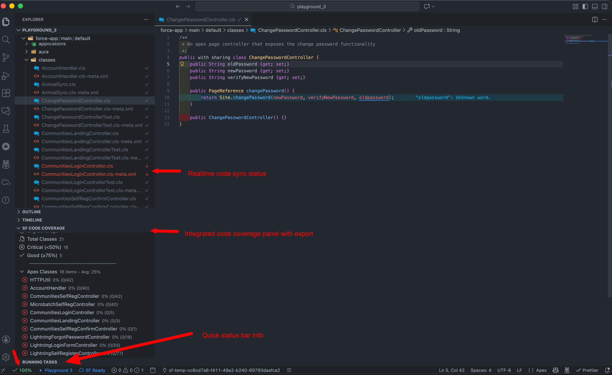

<p align="center">
  
</p>

<h1 align="center">SF Metadata Tracker</h1>

<p align="center">
  <strong>Real-time Salesforce metadata sync status and code coverage for VS Code</strong>
</p>

<p align="center">
  <a href="https://marketplace.visualstudio.com/items?itemName=avidev9.sf-metadata-tracker">
    
  </a>
  
  <a href="LICENSE">
    
  </a>
</p>

<p align="center">
  <a href="#features">Features</a> •
  <a href="#installation">Installation</a> •
  <a href="#usage">Usage</a> •
  <a href="#commands">Commands</a> •
  <a href="#configuration">Configuration</a>
</p>

---

## Overview

SF Metadata Tracker provides real-time visibility into your Salesforce metadata sync status. Know instantly whether your local files match the org, who last modified them, and get comprehensive code coverage insights—all without leaving your editor.

<p align="center">
  
</p>

---

## Features

### 🔄 Metadata Sync Status

| Feature | Description |
|---------|-------------|
| **Status Bar** | View sync status with last modified info |
| **File Decorations** | Color-coded badges: 🟢 In Sync · 🟡 Modified · 🔵 New |
| **Smart Caching** | Intelligent caching to minimize API calls |
| **Background Scanning** | Automatic metadata scanning with progress indicator |

### 🧪 Code Coverage & Testing

| Feature | Description |
|---------|-------------|
| **Coverage Panel** | Sidebar panel showing coverage for all Apex classes |
| **Run All Tests** | Execute all local tests with real-time progress |
| **Run Single Test** | Run tests for current file with detailed results |
| **Coverage Highlighting** | Visual line-by-line coverage in editor |
| **Export** | Export coverage to CSV or JSON |

### ☁️ Deploy & Retrieve

| Feature | Description |
|---------|-------------|
| **Quick Deploy** | Deploy current file directly from VS Code |
| **Quick Retrieve** | Retrieve latest version from org |
| **Context Menus** | Right-click integration in Explorer and Editor |
| **Org Management** | Authorize and switch between orgs |

---

## Supported Metadata

| Type | Extensions |
|------|------------|
| Apex Classes | `.cls` |
| Apex Triggers | `.trigger` |
| Lightning Web Components | `.js`, `.html`, `.css` |
| Aura Components | `.cmp`, `.app`, `.evt` |
| Visualforce Pages | `.page` |
| Visualforce Components | `.component` |
| Flows | `.flow-meta.xml` |

---

## Installation

### From VS Code Marketplace

1. Open VS Code
2. Press `Cmd+Shift+X` (macOS) or `Ctrl+Shift+X` (Windows/Linux)
3. Search for **"SF Metadata Tracker"**
4. Click **Install**

**[→ Install from VS Code Marketplace](https://marketplace.visualstudio.com/items?itemName=avidev9.sf-metadata-tracker)**

### Prerequisites

- VS Code **v1.61.0+**
- Salesforce CLI (`sf`) installed and in PATH
- Salesforce DX project with `sfdx-project.json`
- Authenticated org connection

---

## Usage

### Quick Start

1. Open a Salesforce DX project in VS Code
2. Extension activates automatically when `sfdx-project.json` is detected
3. View sync status in status bar and file explorer
4. Click status bar item for detailed info and quick actions

### Status Bar

Click the status bar to view:
- Last modified by (with relative time)
- Created by (with relative time)  
- Connected org information
- Quick actions: Deploy, Retrieve, Refresh

### Code Coverage Panel

Find **SF Code Coverage** in the Explorer sidebar:
- View org-wide coverage summary
- Click any class to open with coverage highlighting
- Use toolbar to run tests, export, or refresh

---

## Commands

Access via Command Palette (`Cmd+Shift+P` / `Ctrl+Shift+P`):

| Command | Description |
|---------|-------------|
| **Show File Org Status** | Display detailed org status |
| **Refresh File Status** | Refresh current file status |
| **Refresh All File Status** | Clear cache and refresh all |
| **Deploy Current File** | Deploy to connected org |
| **Retrieve Current File** | Retrieve from org |
| **Authorize Org** | Authorize a new org |
| **Switch Default Org** | Switch to different org |
| **Toggle Coverage Highlighting** | Show/hide coverage in editor |
| **Refresh Code Coverage** | Refresh coverage data |
| **Run Apex Tests** | Run tests for current class |
| **Run All Local Tests** | Run all tests with progress |
| **Export Code Coverage** | Export to CSV or JSON |

---

## Configuration

Configure in VS Code Settings (`Cmd+,` / `Ctrl+,`):

| Setting | Default | Description |
|---------|---------|-------------|
| `sfMetadataTracker.showStatusBar` | `true` | Show sync status in status bar |
| `sfMetadataTracker.showFileDecorations` | `true` | Show decorations in Explorer |
| `sfMetadataTracker.cacheTTL` | `60` | Cache TTL in seconds |
| `sfMetadataTracker.showScanSummary` | `true` | Show summary after scanning |
| `sfMetadataTracker.showCoverageStatus` | `true` | Show coverage in status bar |

---

## Troubleshooting

<details>
<summary><strong>Extension not activating</strong></summary>

- Ensure workspace contains `sfdx-project.json`
- Verify Salesforce CLI: `sf --version`
</details>

<details>
<summary><strong>"No Org" or "Auth Expired" error</strong></summary>

- Check default org: `sf org display`
- Authenticate: `sf org login web`
- Set default: `sf config set target-org <alias>`
</details>

<details>
<summary><strong>Status not updating</strong></summary>

- Use "Refresh File Status" command
- Use "Refresh All File Status" to clear caches
</details>

<details>
<summary><strong>Code coverage not showing</strong></summary>

- Run tests in the org first
- Use "Refresh Code Coverage"
</details>

---

## Contributing

Contributions are welcome! Please feel free to submit a Pull Request.

```bash
# Clone the repository
git clone https://github.com/Avinava/vscode-sf-metadata-tracker.git

# Install dependencies
yarn install

# Run linting
yarn lint

# Build
yarn build
```

---

## Changelog

See **[CHANGELOG.md](CHANGELOG.md)** for version history.

**Latest in v1.9.0:**
- Run All Local Tests with real-time progress
- Export coverage to CSV/JSON
- Interactive Code Coverage Panel

---

## License

MIT License - see [LICENSE](LICENSE) for details.

---

<p align="center">
  Built with ❤️ for the Salesforce developer community
</p>

<p align="center">
  <a href="https://github.com/Avinava/vscode-sf-metadata-tracker/issues">Report Bug</a> •
  <a href="https://github.com/Avinava/vscode-sf-metadata-tracker/issues">Request Feature</a>
</p>
